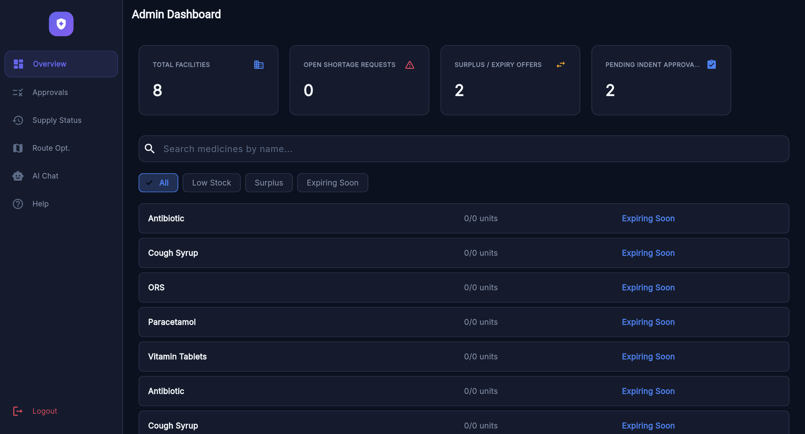
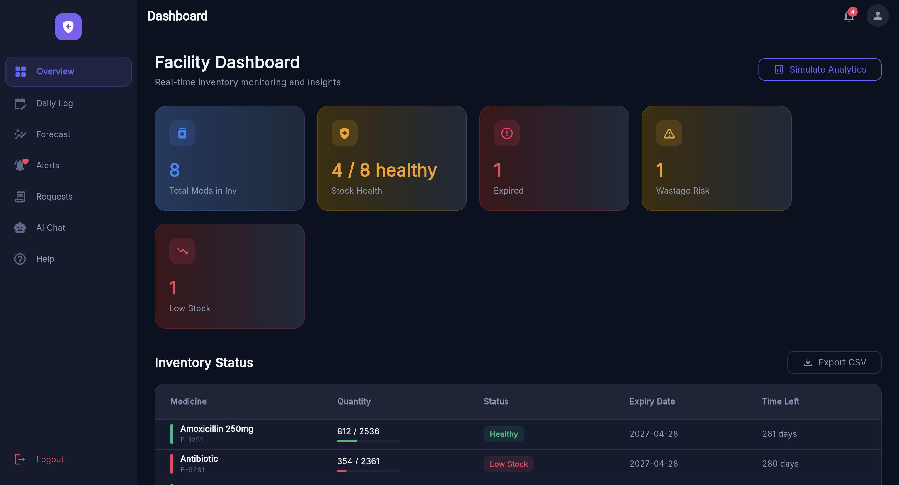
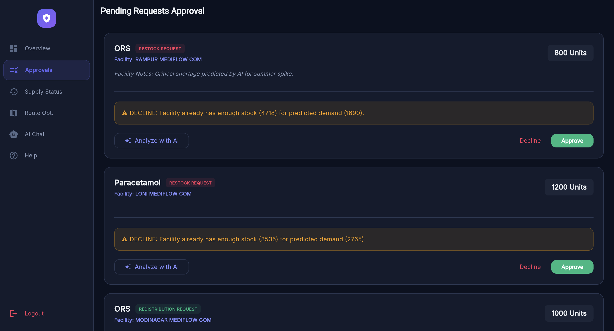
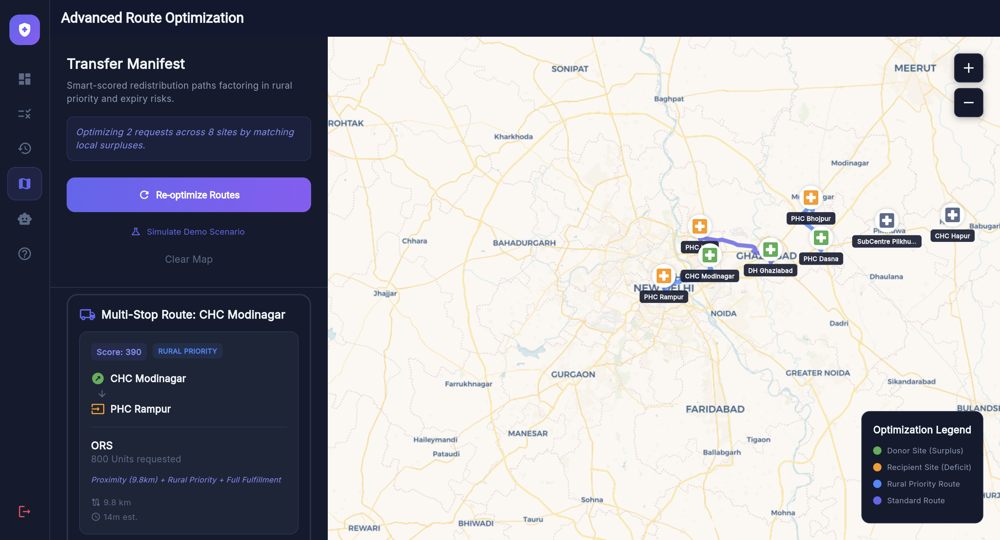
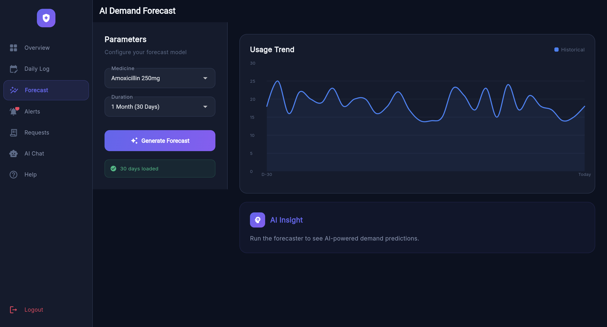
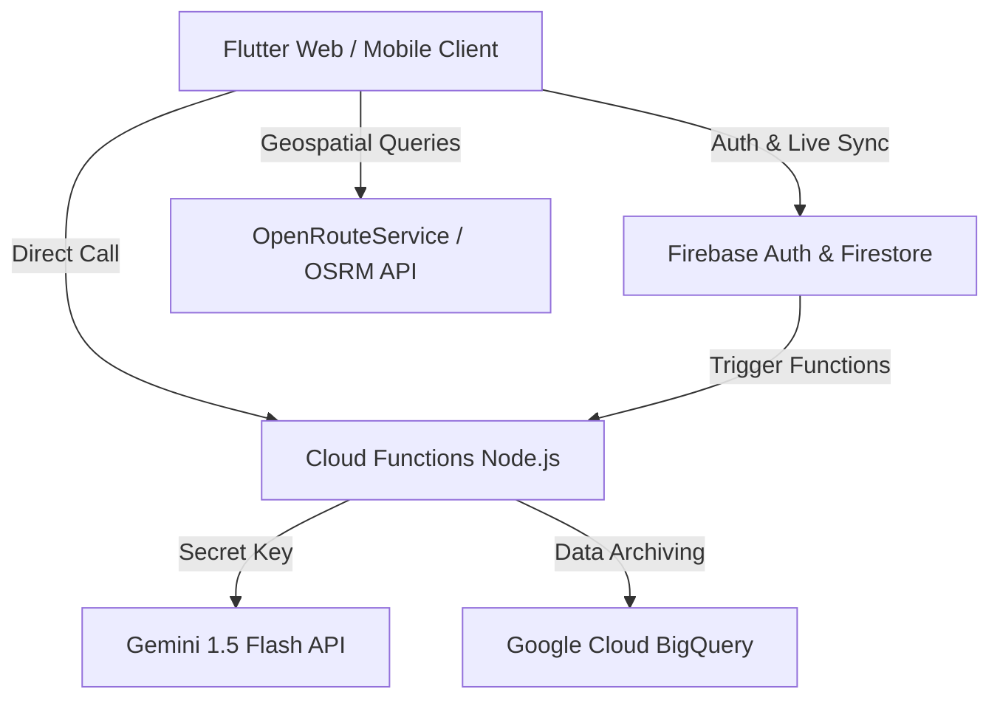

# MediFlow

AI-powered medical logistics platform focused on smart resource allocation


---

## Table of Contents

- [Project Overview](#project-overview)
- [The Problem & Solution](#the-problem--the-solution)
- [Screenshots & UI Preview](#screenshots--ui-preview)
- [Core Feature Set](#core-feature-set)
- [Technical Architecture](#technical-architecture)
- [Project Structure](#project-structure)
- [Data & Schema](#data--schema)
- [Development & Setup Guide](#development--setup-guide)
- [Troubleshooting](#troubleshooting)
- [Future Developments](#future-developments)
- [Contributing](#contributing)
- [License](#license)
- [The Team](#the-team)

---

## Project Overview

**MediFlow** is an enterprise-grade medical logistics platform engineered to
solve the "Last Mile" medical supply crisis. By combining **Generative AI** for
demand forecasting with **Heuristic Heuristics**, we optimize redistribution of
medical supplies across a network of urban and rural healthcare facilities.

---

## The Problem | The Solution

**The Crisis:** Rural clinics often face 30% higher stockout rates for essential
antibiotics, while urban hospitals simultaneously dispose of expired stock due
to over-purchasing. This inequality claims lives.

**The MediFlow Solution:** We don't just track inventory; we **predict**
shortages before they happen and **automate** the movement of medicine from
surplus hospitals to deficit clinics using road-optimized routing.

---

## Screenshots & UI Preview

Here is a preview of the MediFlow home page:


MediFlow provides two types of roles:

- Role -> Admin

Here is a preview of Admin Dashboard


- Role -> Facility

Here is a preview of Facility manager Dashboard


It also provides following features:

- AI analysis of supply


- Route optimization for delivery via AI (Admin only)


- Demand forecast


---

## Core Feature Set

### Hospital / Facility Module

| Feature | Detailed Description |
| :--- | :--- |
| **Smart Logging Engine** | Atomically track daily usage while the system computes burn rates in real-time, ensuring zero data loss even in low-connectivity areas. |
| **AI Forecasting (30-Day)** | Powered by **Gemini-1.5-Flash**, predicting seasonal spikes based on historical usage trends (e.g., ORS demand for summer) with a transparency-first "AI Reasoning". |
| **Automated Request Drafting** | Intelligent auto-population of restock indents and redistribution offers based on AI predictions, reducing administrative overhead for clinic managers. |
| **AI Chat Assistant** | A 24/7 logistics expert that facility managers can query for stock status, expiry alerts, or burn-rate insights using natural language. |

### Central Administration Module

| Feature | Detailed Description |
| :--- | :--- |
| **Global Command Center** | Real-time regional oversight with deep-dive analytics into every facility's stock health, parity, and regional logistics KPIs. |
| **Approval Pipeline** | A secure hub for regional admins to review, edit, and prioritize redistribution plans proposed by the optimization engine. |
| **Interactive Logistics Map** | High-visibility markers distinguishing surplus sites from deficit clinics with integrated OSRM/ORS paths that calculate real-world travel time and distance. |
| **Global Optimization** | A "Global Redistribution Plan" that matches thousands of shortage items to local surpluses in seconds using our proprietary matching logic. |

---

## Technical Architecture

MediFlow utilizes a decoupled, serverless architecture that bridges a
responsive frontend client with intelligent background processing.

### Architecture Overview



### Key Technical Pillars

1. **AI Engine (Gemini 1.5 Flash):** We leverage Gemini's large context window
   to process months of anonymized usage logs. The model acts as a **Predictive
   Reasoning Layer**, identifying non-obvious redistribution opportunities.

2. **Optimization Heuristic (OTS):** Our proprietary **Optimal Transfer Score**
   ensures that redistribution is both efficient and equitable:

   $$OTS = (w_{dist} \cdot Proximity) + (w_{prior} \cdot RuralPriority) +
   (w_{qty} \cdot QtyMatch)$$

   - **Proximity:** Minimizes logistics cost and time.
   - **Rural Priority:** A weight multiplier ensuring that remote facilities are
     never starved by the algorithm.

3. **Geospatial Routing System:** Integrated with **flutter_map** and
   **OSRM/OpenRouteService**, our routing engine decodes complex polylines to
   provide precise, road-accurate delivery paths.

---

## Project Structure

```bash
lib/
├── constants/
│   └── colors.dart             # Project-wide design tokens & premium palette
│
├── models/                     # Immutable Data Domain
│   ├── daily_usage_log.dart    # Atomic snapshots of medicine consumption
│   ├── facility.dart           # Metadata & Geospatial profiles for nodes
│   ├── inventory_item.dart     # Stock tracking & expiry metadata
│   ├── request.dart            # Ledger for redistribution & restock flows
│   └── usage_log.dart          # Helper models for analytics visualization
│
├── services/                   # Business Logic & Intelligence Layer
│   ├── ai_service.dart         # Gemini-1.5-Flash forecasting & reasoning
│   ├── chat_service.dart       # NLP pipeline for the AI Assistant
│   ├── firebase_service.dart   # Firestore infrastructure & transactions
│   ├── optimization_service.dart # OTS heuristic & matching algorithm
│   ├── routing_service.dart    # Geospatial OSRM/ORS pathfinding logic
│   ├── simulation_service.dart # Real-time demo data generation engine
│   └── tool_dispatcher.dart    # AI tool-calling & data registry
│
├── views/                      # Presentation Layer (UI)
│   ├── admin/                  # Central Command Module
│   │   ├── admin_indent_approval_page.dart
│   │   ├── admin_indent_status_page.dart
│   │   ├── admin_overview.dart
│   │   └── route_optimization_map.dart
│   │
│   ├── auth/                   # Security & Role Gatekeeping
│   │   ├── login_screen.dart
│   │   └── role_selection_screen.dart
│   │
│   ├── facility/               # Local Management Module
│   │   ├── active_indents_page.dart
│   │   ├── ai_forecast_page.dart
│   │   ├── alerts_page.dart
│   │   ├── daily_logging_page.dart
│   │   ├── facility_overview.dart
│   │   └── indent_creation_page.dart
│   │
│   └── shared/                 # Common & Reusable Components
│       ├── ai_chat_page.dart
│       ├── help_page.dart
│       └── sidebar_layout.dart
│
├── firebase_options.dart       # Cross-platform Firebase configuration
└── main.dart                   # Application entry & Router configuration
```

---

## Data & Schema

MediFlow utilizes a hierarchical Firestore schema designed for
high-concurrency performance:

- **`/facilities`**: Metadata, type (urban/rural), and geospatial coordinates.
- **`/inventory/{fac_id}/medicines`**: Sub-collection tracking individual
  batches and live stock levels.
- **`/requests`**: Global collection for tracking movement, status
  (Pending/Approved/Fulfilled), and manifest details.

---

### 🔑 Demo Credentials

| Role | Email ID | Password | Facility Type |
| :--- | :--- | :--- | :--- |
| **CMS Admin** | `admin@mediflow.com` | `password123` | Central Management |
| **Facility Head** | `rampur@mediflow.com` | `password123` | Rural PHC |
| **Facility Head** | `modinagar@mediflow.com` | `password123` | Urban CHC |
| **Facility Head** | `loni@mediflow.com` | `password123` | Urban PHC |
| **Facility Head** | `ghaziabad@mediflow.com` | `password123` | District Hospital |
| **Facility Head** | `bhojpur@mediflow.com` | `password123` | Rural PHC |
| **Facility Head** | `hapur@mediflow.com` | `password123` | Urban CHC |
| **Facility Head** | `dasna@mediflow.com` | `password123` | Rural PHC |
| **Facility Head** | `pilkhuwa@mediflow.com` | `password123` | Rural Sub-Centre |

> [!NOTE]
> If the dashboard appears empty, use the **"Seed DB"** button on the
> Login/Role Selection screen to populate the database with demo records.

---

## Development & Setup Guide

### Prerequisites

- [Flutter SDK](https://docs.flutter.dev/get-started/install) (>=3.0.0,
  recommended `3.41.x`)
- [Node.js](https://nodejs.org/) (for Firebase Cloud Functions deployment)
- Firebase Project configured on
  [Firebase Console](https://console.firebase.google.com/)
- Google AI Studio API Key (for Gemini)
- OpenRouteService API Key (for route calculations)

### Local Setup Steps

1. **Clone the Repository:**

   ```bash
   git clone https://github.com/Nebulyn-Labs/MediFlow.git
   cd MediFlow
   ```

2. **Fetch Dependencies:**

   ```bash
   flutter pub get
   ```

3. **Configure the Environment:**

   Create a `.env` file in the root of the project (and copy from
   `.env.example` if needed):

   ```ini
   GEMINI_API_KEY=your_gemini_api_key
   ORS_API_KEY=your_openroute_service_key
   FIREBASE_PROJECT_ID=mediflow-92e6f
   ```

4. **Initialize Firebase CLI (if modifying functions):**

   ```bash
   npm install -g firebase-tools
   firebase login
   firebase use mediflow-92e6f
   ```

5. **Run the Application:**

   For local web prototype development, run:

   ```bash
   flutter run -d chrome
   ```

6. **Configure Firebase App Check (Important):**

   This project uses Firebase App Check to protect backend resources.

   - **Android:** Play Integrity is used in release builds, and debug mode
     uses a Debug token. You must register your app's SHA-256 certificate
     in the Firebase Console under App Check.

   - **Web:** We use reCAPTCHA v3. Provide your site key during build or run
     time:

     ```bash
     flutter run -d chrome \
       --dart-define=RECAPTCHA_SITE_KEY=your_recaptcha_site_key
     ```

     *Note: If no key is provided, the app will continue to run, but App
     Check will remain inactive for web. If App Check enforcement is enabled
     in the Firebase Console, requests may be rejected.*

---

## Troubleshooting

### 1. `asset_does_not_exist` Error for `.env`

If compilation fails with an error indicating `.env` does not exist:

- Make sure you created a `.env` file in the root folder.
- If you don't have API keys yet, you can create a placeholder `.env` with
  dummy values:

  ```ini
  GEMINI_API_KEY=dummy_key
  ORS_API_KEY=dummy_key
  ```

### 2. Web Map Fails to Render (CORS or Rendering mode)

If the map does not display in your web browser:

- If the CanvasKit renderer encounters issues fetching tiles from
  OpenStreetMap due to CORS, check your OpenRouteService API key and network
  settings. Ensure all Firebase dependencies are up to date.
- Verify that your OpenRouteService API key is valid and has not exceeded its
  request limit.

### 3. Cloud Functions Authentication Errors

If calling Gemini forecasts yields an authentication error:

- Ensure you are logged in to the application.
- Verify that you have deployed the Cloud Functions and configured secrets:

  ```bash
  firebase functions:secrets:set GEMINI_API_KEY="your_actual_key"
  ```

---

## Future Developments

- [ ] **Offline-First Sync:** Native SQLite integration for zero-connectivity
  environments.
- [ ] **Batch Tracking:** QR-code integration for granular tracking of
  individual medicine strips.
- [ ] **IoT Cold Chain:** Integration with sensors to track temperature-sensitive
  vaccines during transit.

---

## Contributing

We welcome contributions! Please review our [CONTRIBUTING.md](CONTRIBUTING.md)
and [CODE_OF_CONDUCT.md](CODE_OF_CONDUCT.md) before submitting pull requests.

---

## License

Distributed under the MIT License. See [LICENSE](LICENSE) for details.

---

## The Team

Built with ❤️ by the MediFlow Team:

- Aarush Yadav
- Paavni Bansal
- Devansh Rana
- Sharvi Singhal

---

© 2026 MediFlow Team. *Engineering a smarter, healthier supply chain.*
